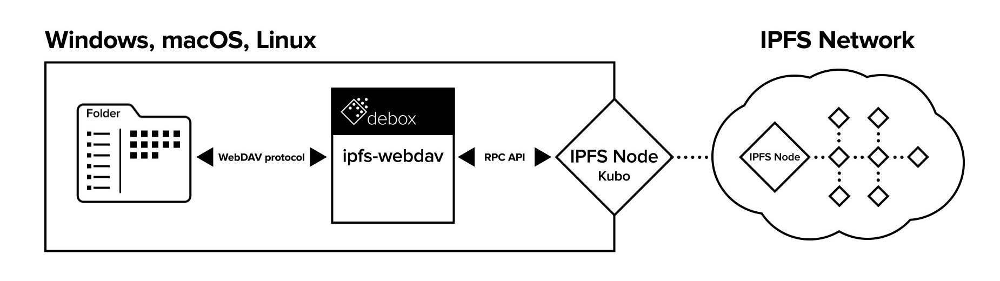

# ipfs-webdav

**ipfs-webdav** is a [WebDAV](http://webdav.org/) server that enables direct access to [IPFS](https://ipfs.io)'s [MFS](https://docs.ipfs.tech/concepts/file-systems/#mutable-file-system-mfs) as a mounted drive. It enables users to interface with the MFS directly through a file explorer or terminal.

Even though IPFS currently offers the ability to mount an IPFS file system, it is still [experimental](https://docs.ipfs.tech/reference/kubo/rpc/#api-v0-mount) and limited to read-only access. **ipfs-webdav** offers a convenient way for read/write access to the files stored on your local IPFS node without having to interact with IPFS, either through the web-ui or cli.



## Installation

Before installing **ipfs-webdav** make sure that the following dependencies are installed:

- rust (refer to [installation instructions](https://www.rust-lang.org/tools/install))
- kubo (refer to [installation instructions](https://docs.ipfs.tech/install/command-line/))

Once all the dependencies are installed, refer to the follow steps to install `ipfs-webdav`:

1. Clone the git repo: `git clone https://github.com/debox-network/ipfs-webdav`
2. Navigate to repo root: `cd ipfs-webdav`
3. Assemble the project `cargo build --package ipfs-webdav --example base --release`

## Running **ipfs-webdav**

Once **ipfs-webdav** is installed on your system, run the project:

1. Launch an IPFS daemon in a terminal: `ipfs daemon`
2. In another terminal run **ipfs-webdav**: `cd target/release/examples && ./base`

## Mounting

Once both the IPFS daemon and **ipfs-webdav** daemon are running, the WebDAV filesystem can be mounted for immediate use. The mounting instructions differ slightly based on your OS. Refer to the appropriate set of instructions below.

#### Linux - via files explorer

1. Open up the default files explorer (usually gnome-files/nautilus)
2. Navigate to `+ Other Locations` on the bottom of the left panel
3. Enter `dav://127.0.0.1:4918` on the bottom bar where the `Enter server address...` prompt is
4. The mounted filesystem should appear in the left panel as: `127.0.0.1:4918`

#### Linux - via CLI (Debian/Ubuntu based distros)

1. Install davfs2 package: `sudo apt-get install davfs2`
2. Create the mountpoint directory: `sudo mkdir /mnt/dav`
3. Mount the WebDAV share: `sudo mount -t davfs http://127.0.0.1:4918 /mnt/dav`

#### Windows

TBD

#### MacOS

TBD

## Testing

**ipfs-webdav** implements the base [RFC4918](https://www.rfc-editor.org/rfc/rfc4918) WebDAV specification.

The official standard for testing any WebDAV implementation is [litmus](http://www.webdav.org/neon/litmus/). All tests will be run using it.

#### Installing Litmus

To get started, first install Litmus:

1. Download the archive: `curl -O http://www.webdav.org/neon/litmus/litmus-0.13.tar.gz`
2. Unpack it: `tar xf litmus-0.13.tar.gz`
3. Navigate to the program folder: `cd litmus-0.13`
4. Configure build: `./configure`
5. Build and install: `make`

#### Running Litmus

Once Litmus is installed, run it to test **ipfs-webdav**: `litmus dav://127.0.0.1:4918`

#### Expected Output of Running Litmus Tests

(Truncated to exclude individual tests)

```text
-> running `basic':  
...  
<- summary for `basic': of 16 tests run: 16 passed, 0 failed. 100.0%  
-> running `copymove':  
...  
<- summary for `copymove': of 13 tests run: 13 passed, 0 failed. 100.0%  
-> running `props':  
...  
<- summary for `props': of 30 tests run: 30 passed, 0 failed. 100.0%  
-> running `locks':  
...  
<- summary for `locks': of 41 tests run: 41 passed, 0 failed. 100.0%  
-> running `http':  
...  
<- summary for `http': of 4 tests run: 4 passed, 0 failed. 100.0%
```

## Thanks & Acknowledgements

### webdav-handler

Much of the WebDAV functionality is based on [webdav-handler](https://crates.io/crates/webdav-handler). Big thanks to [Miquel](https://github.com/miquels) for his ongoing work in creating/maintaining an elegant rust implementation of the WebDAV protocol.

### ipfs-api

[ipfs-api](https://crates.io/crates/ipfs-api) is a great rust implementation of the IPFS RPC API, which tremendously helped in interfacing with IPFS.

## License

Licensed under either of

* Apache License, Version 2.0
  ([LICENSE-APACHE](LICENSE-APACHE) or http://www.apache.org/licenses/LICENSE-2.0)
* MIT license
  ([LICENSE-MIT](LICENSE-MIT) or http://opensource.org/licenses/MIT)

at your option.

## Contribution

Unless you explicitly state otherwise, any contribution intentionally submitted for inclusion in the work by you, as defined in the Apache-2.0 license, shall be dual licensed as above, without any additional terms or conditions.
